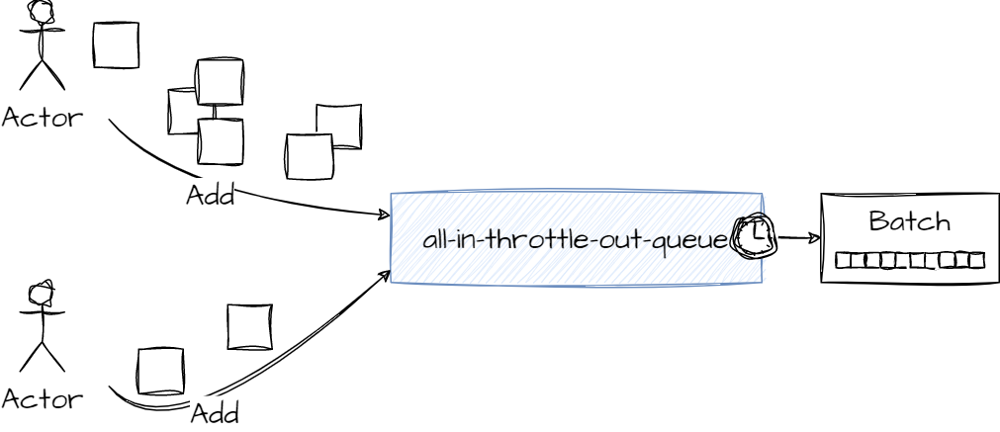
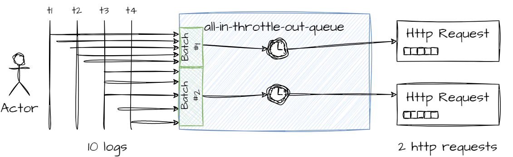

[](https://github.com/MrDesjardins/all-in-throttle-out-queue/actions/workflows/action.yml)
[](https://codecov.io/gh/MrDesjardins/all-in-throttle-out-queue)
[](https://mrdesjardins.github.io/all-in-throttle-out-queue/dev/bench/)


# All-in-throttle-out-queue TypeScript

A queue that take all the input it receives and wait a specific time to output the result



# Use cases?

## Network Calls

Add multiple data in the queue, then after some times take a batch of data to send to a network call



## User Interface

For user movements/actions to send 1 payload instead of multiple to avoid traffic and lags but still capturing every piece of data

# How to Use?

Install with NPM:

```sh
npm install --save all-in-throttle-out-queue
```

The project is in TypeScript. The build contains an ESCommon and CommonJS version with `.d.ts`

```typescript
// Create the queue with the type you want to hold. E.g. `number`
const aitoq = new AllInThrottledOutQueue<number>((batch: number[]) => {
  // The function is called after 1000 seconds of the first add
  console.log("Here is the list of number from the last 1000 seconds", batch);
}, 1000);

aitoq.add(1); // Will start the internal timer of 1000 milliseconds (see the second parameter)
aitoq.add(2); // Will be batched in the queue
// After 1000 seconds of the first call, the function is called with the argument [1, 2]
```

# Timer

The timer is not always running. If there is many call to the `add` function, the first time the `AllInThrottledOutQueue` detects that there is no timer and start one. Until the throttleling is completed (function is called) there is always only a single timer. A new timer is only executed if there is another `add` called once there is no timer.

```typescript
// t=0
aitoq.add(1); // Start timer
//t= 100
aitoq.add(2); // Time is still < 1000, same timer (batch)
//t= 1001
//Function called, batch released and back to an empty queue with no timer
//t= 2000
//Still no timer, no need, nothing in the queue
aitoq.add(3); // Start timer
```
